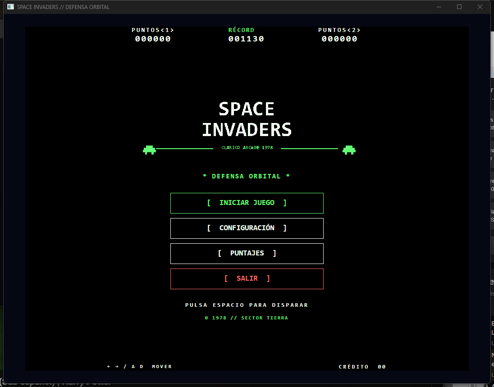
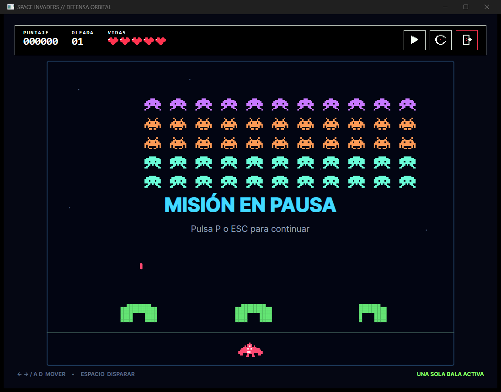

# Space Invaders — Avalonia MVVM

Juego de escritorio construido con C#, .NET 10, Avalonia 12.1 y CommunityToolkit.Mvvm.

## Capturas

### Menú principal



### Partida



## Ejecutar

```powershell
dotnet run --project src/SpaceInvaders/SpaceInvaders.csproj
```

Controles: flechas o `A/D` para moverse, `Espacio` para disparar y `P` o `Escape` para pausar.

## Reemplazar los assets

Los recursos gráficos se encuentran en `src/SpaceInvaders/Assets/Images` y están registrados como `AvaloniaResource`.

| Elemento | Archivo actual | Tamaño recomendado |
|---|---|---:|
| Nave azul | `Ships/ship-blue.png` | 64×40 px |
| Nave roja | `Ships/ship-red.png` | 64×40 px |
| Nave verde | `Ships/ship-green.png` | 64×40 px |
| Squid | `Aliens/squid.png` | 44×32 px |
| Crab | `Aliens/crab.png` | 44×32 px |
| Octopus | `Aliens/octopus.png` | 44×32 px |
| UFO | `Aliens/ufo.png` | 64×28 px |
| Logo del menú | `Interface/space-invaders-logo.png` | 900×300 px |
| Vida disponible | `Interface/heart-full.png` | 32×32 px |
| Vida perdida | `Interface/heart-empty.png` | 32×32 px |
| Reanudar | `Interface/icon-play.png` | 24×24 px |
| Pausar | `Interface/icon-pause.png` | 24×24 px |
| Reiniciar | `Interface/icon-restart.png` | 24×24 px |
| Salir | `Interface/icon-exit.png` | 24×24 px |

La forma más sencilla de cambiar un diseño es reemplazar su PNG manteniendo el mismo nombre. Se recomienda fondo transparente y una proporción parecida; la vista ajusta automáticamente el sprite al tamaño lógico del objeto.

Para utilizar JPG, coloca el archivo en la misma carpeta y cambia la ruta correspondiente en `Helpers/AssetPaths.cs`, por ejemplo de `ship-blue.png` a `ship-blue.jpg`. Avalonia incluye todos los archivos bajo `Assets/**`, por lo que no es necesario modificar el proyecto.

## Puntajes

El top 10 y la nave seleccionada se guardan como JSON en la carpeta local de la aplicación:

`%LOCALAPPDATA%\SpaceInvaders\scores.json` en Windows.

`%LOCALAPPDATA%\SpaceInvaders\settings.json` contiene la configuración del hangar.

No se utiliza base de datos ni servicio en línea.
